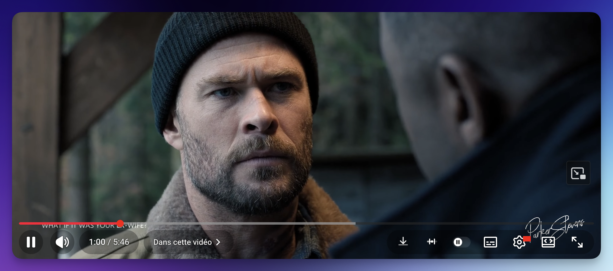

# Youtube Cobalt Quick Download

> One-click download button injected directly into the YouTube player toolbar — opens [cobalt.meowing.de](https://cobalt.meowing.de) with the video URL pre-filled. No copy-pasting, no hassle.

---

## How it works

**1.** Click the **↓** button in the YouTube player toolbar
**2.** [cobalt.meowing.de](https://cobalt.meowing.de) opens in a new tab with the URL ready
**3.** Pick your settings → hit download

| | |
|---|---|
|  |  |
| *Processing in progress* | *Download complete — 196 MB* |

---

## Installation

**1. Install a userscript manager**

| Extension | Browser |
|---|---|
| [ScriptCat](https://scriptcat.org/en) ⭐ *recommended* | Chrome, Firefox, Edge, Safari |
| [Tampermonkey](https://www.tampermonkey.net/) | Chrome, Firefox, Edge, Safari |

**2. Install the script**

Download [`cobalt-quick-download.user.js`](cobalt-quick-download.user.js) and drag & drop it into your userscript manager dashboard — or click the file directly if your manager supports auto-install.

**3. Done**

Navigate to any YouTube video. The download button appears in the player toolbar automatically.

---

## Recommended Settings

Configure cobalt.meowing.de once and every download will follow your preferences.

### 🎬 Video

| Setting | Recommended | Notes |
|---|---|---|
| Quality | `4k` | Falls back to next best if unavailable |
| Codec | `av1 + opus` | Best quality & efficiency, supports 8K + HDR |
| Container | `auto` | mp4 for h264 · webm for av1/vp9 |

### 🎵 Audio

| Setting | Recommended | Notes |
|---|---|---|
| Format | `best` | Keeps original format, no re-encoding |
| Bitrate | `128kb/s` | Going higher won't improve quality |
| YouTube quality | enabled | Picks highest available audio track |

### 🗂 Metadata

| Setting | Recommended | Notes |
|---|---|---|
| Filename style | `basic` | `Title - Author (quality, codec).ext` |
| Saving method | `download` | Saves directly without prompting |
| Subtitles | your language | Added automatically if available |

---

## Notes

- The script only triggers the cobalt frontend — no API calls are made directly
- No auth issues, no CORS, no rate limits
- The URL is passed via `#hash`, which cobalt reads natively
- Works on `youtube.com/watch*` and `youtu.be/*`